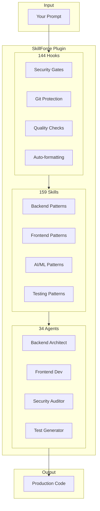

<!-- markdownlint-disable MD033 MD041 -->
<div align="center">

# SkillForge Claude Plugin

### Stop re-explaining your codebase to Claude. Start shipping.

[](https://claude.ai/claude-code)
[](./skills)
[](./agents)
[](./hooks)
[](./LICENSE)

[Why SkillForge?](#why-skillforge) · [Quick Start](#quick-start) · [Commands](#commands) · [Skills](#skills) · [Agents](#agents) · [FAQ](#faq)

</div>

---

## Why SkillForge?

**The Problem:** Every Claude Code session starts from zero. You explain your stack, your patterns, your preferences—again and again.

**The Solution:** SkillForge gives Claude persistent knowledge of 159 production patterns, 34 specialized agents, and 144 security/quality hooks that work automatically.

| Without SkillForge | With SkillForge |
|-------------------|-----------------|
| "Use FastAPI with async SQLAlchemy 2.0 and Pydantic v2 settings..." | Just say "create an API endpoint" |
| "Remember to use cursor pagination, not offset..." | Agents know your patterns |
| "Don't commit to main branch..." | Hooks block it automatically |
| "Run tests before committing..." | `/skf:commit` handles everything |

### What You Get

```
┌─────────────────────────────────────────────────────────────────────┐
│                         YOUR PROMPT                                 │
└─────────────────────────────────────────────────────────────────────┘
                                │
                                ▼
┌─────────────────────────────────────────────────────────────────────┐
│  ┌──────────────┐  ┌──────────────┐  ┌──────────────┐              │
│  │   144 HOOKS  │  │  159 SKILLS  │  │  34 AGENTS   │              │
│  │              │  │              │  │              │              │
│  │ • Security   │  │ • FastAPI    │  │ • Backend    │              │
│  │ • Git guard  │  │ • React 19   │  │ • Frontend   │              │
│  │ • Auto-test  │  │ • LangGraph  │  │ • Security   │              │
│  │ • Quality    │  │ • Testing    │  │ • Database   │              │
│  └──────────────┘  └──────────────┘  └──────────────┘              │
│                         SKILLFORGE                                  │
└─────────────────────────────────────────────────────────────────────┘
                                │
                                ▼
┌─────────────────────────────────────────────────────────────────────┐
│                    PRODUCTION-READY CODE                            │
└─────────────────────────────────────────────────────────────────────┘
```

---

## Quick Start

### Installation (30 seconds)

```bash
# From Claude Code
/plugin marketplace add yonatangross/skillforge-claude-plugin
/plugin install skf
```

### Verify It Works

```bash
/skf:doctor
```

You should see:
```
✅ Plugin loaded successfully
✅ 159 skills available
✅ 34 agents ready
✅ 144 hooks active
```

### Try It

```bash
# Commit with conventional format + pre-commit checks
/skf:commit

# Get a code review checklist
/skf:review-pr

# Explore your codebase structure
/skf:explore
```

---

## Commands

**20 slash commands** for common workflows:

| Command | What It Does |
|---------|--------------|
| `/skf:doctor` | Check plugin health and configuration |
| `/skf:configure` | Setup MCP servers (Context7, Memory, Playwright) |
| `/skf:commit` | Guided commit with conventional format |
| `/skf:create-pr` | Create PR with summary and test plan |
| `/skf:review-pr` | Code review checklist |
| `/skf:explore` | Analyze codebase structure |
| `/skf:implement` | Implement a feature with agent guidance |
| `/skf:verify` | Verify implementation correctness |
| `/skf:fix-issue` | Fix a GitHub issue |
| `/skf:claude-hud` | Configure context window HUD |
| `/skf:remember` | Save information to memory |
| `/skf:recall` | Retrieve from memory |
| `/skf:load-context` | Load relevant memories at session start |
| `/skf:feedback` | Submit feedback or suggestions |
| `/skf:brainstorming` | Structured ideation session |
| `/skf:add-golden` | Add golden test dataset |
| `/skf:skill-evolution` | Evolve skills based on usage |
| `/skf:git-recovery-command` | Recover from git mistakes |
| `/skf:mem0-sync` | Sync memories to Mem0 cloud |
| `/skf:worktree-coordination` | Coordinate multiple Claude instances |

---

## Skills

**159 skills** organized by domain, loaded progressively to save tokens (~70% reduction):

### AI/ML (27 skills)
`rag-retrieval` · `embeddings` · `llm-streaming` · `function-calling` · `agentic-rag-patterns` · `prompt-engineering-suite` · `fine-tuning-customization` · `high-performance-inference` · `vision-language-models` · `mcp-security-hardening` · `advanced-guardrails` · `llm-safety-patterns` ...

### Backend (19 skills)
`fastapi-advanced` · `sqlalchemy-2-async` · `asyncio-advanced` · `celery-advanced` · `temporal-io` · `strawberry-graphql` · `grpc-python` · `saga-patterns` · `cqrs-patterns` · `connection-pooling` · `rate-limiting` ...

### Frontend (23 skills)
`react-server-components-framework` · `tanstack-query-advanced` · `zustand-patterns` · `form-state-patterns` · `core-web-vitals` · `lazy-loading-patterns` · `view-transitions` · `pwa-patterns` · `recharts-patterns` ...

### Testing (10 skills)
`pytest-advanced` · `msw-mocking` · `property-based-testing` · `contract-testing` · `e2e-testing` · `integration-testing` · `test-data-management` · `vcr-http-recording` ...

### Security (5 skills)
`owasp-top-10` · `auth-patterns` · `input-validation` · `defense-in-depth` · `security-scanning`

### DevOps & Git (10 skills)
`github-operations` · `git-workflow` · `stacked-prs` · `release-management` · `observability-monitoring` · `devops-deployment` ...

<details>
<summary><strong>View all 159 skills</strong></summary>

```bash
ls skills/
```

</details>

---

## Agents

**34 specialized agents** that automatically activate based on your task:

| Agent | Specialty | Triggers On |
|-------|-----------|-------------|
| `backend-system-architect` | REST/GraphQL APIs, microservices | "create API", "design endpoint" |
| `frontend-ui-developer` | React 19, TypeScript, components | "build component", "create page" |
| `database-engineer` | PostgreSQL, migrations, pgvector | "design schema", "optimize query" |
| `security-auditor` | OWASP Top 10, vulnerability scanning | "security review", "audit code" |
| `test-generator` | Unit/integration tests, MSW mocking | "write tests", "add coverage" |
| `workflow-architect` | LangGraph, multi-agent orchestration | "create workflow", "agent pipeline" |
| `performance-engineer` | Core Web Vitals, bundle optimization | "optimize performance", "slow page" |
| `ai-safety-auditor` | LLM safety, prompt injection defense | "AI security", "guardrails" |
| `prompt-engineer` | Chain-of-thought, few-shot learning | "improve prompt", "prompt design" |
| `monitoring-engineer` | Prometheus, Grafana, alerting | "add monitoring", "observability" |
| `accessibility-specialist` | WCAG 2.2, ARIA, focus management | "a11y", "accessibility" |
| `event-driven-architect` | Event sourcing, message queues | "event-driven", "CQRS" |
| `ci-cd-engineer` | GitHub Actions, deployment pipelines | "CI/CD", "pipeline" |
| `debug-investigator` | Root cause analysis, debugging | "debug", "investigate error" |
| ... | ... | ... |

<details>
<summary><strong>View all 34 agents</strong></summary>

```bash
ls agents/
```

</details>

---

## Architecture



### Directory Structure

```
skillforge-claude-plugin/
├── skills/                  # 159 knowledge modules
│   └── <skill-name>/
│       ├── SKILL.md         # Overview + patterns
│       ├── references/      # Implementation guides
│       └── templates/       # Code templates
├── agents/                  # 34 specialized agents
│   └── <agent-name>.md
├── hooks/                   # 144 lifecycle hooks
│   ├── pretool/             # Security gates
│   ├── posttool/            # Quality checks
│   └── lifecycle/           # Session management
├── .claude/
│   ├── commands/            # Slash command configs
│   ├── context/             # Session state
│   └── coordination/        # Multi-instance locks
└── tests/                   # Comprehensive test suite
```

---

## Comparison

| Feature | SkillForge | [claude-code-showcase](https://github.com/ChrisWiles/claude-code-showcase) | DIY Hooks |
|---------|------------|----------------------|-----------|
| Skills/Patterns | **159** | ~10 | 0 |
| Specialized Agents | **34** | ~5 | 0 |
| Security Hooks | **8-layer defense** | Basic | Manual |
| Setup Time | **2 minutes** | 5 minutes | Hours |
| Maintenance | Automatic | Manual | Manual |
| AI/ML Patterns | **27 skills** | Limited | None |
| Testing Patterns | **10 skills** | Basic | None |

---

## Configuration

### MCP Servers (Optional)

Enhance capabilities with Model Context Protocol servers:

```bash
/skf:configure
```

| Server | Purpose | Auto-Enable |
|--------|---------|-------------|
| Context7 | Up-to-date library docs | At 75% context |
| Memory (graph) | Persistent knowledge graph | At 90% context |
| Sequential Thinking | Complex reasoning | At 60% context |
| Playwright | Browser automation | At 50% context |
| Mem0 (cloud) | Semantic search | Optional |

### Environment Variables

```bash
CLAUDE_PROJECT_DIR      # Your project directory
CLAUDE_PLUGIN_ROOT      # Plugin installation path
CLAUDE_SESSION_ID       # Current session ID
MEM0_API_KEY            # Optional: Mem0 cloud integration
```

---

## FAQ

<details>
<summary><strong>Plugin not found after installation?</strong></summary>

```bash
# Verify installation
/plugin list

# Reinstall if needed
/plugin uninstall skf
/plugin marketplace add yonatangross/skillforge-claude-plugin
/plugin install skf
```

</details>

<details>
<summary><strong>Hooks not firing?</strong></summary>

1. Check hook logs: `tail -f hooks/logs/*.log`
2. Verify settings: Check `.claude/settings.json` exists
3. Run diagnostics: `/skf:doctor`

</details>

<details>
<summary><strong>How do I add my own skills?</strong></summary>

```bash
# Create skill directory
mkdir -p skills/my-skill/references

# Create SKILL.md with frontmatter
cat > skills/my-skill/SKILL.md << 'EOF'
---
name: my-skill
description: What this skill provides
tags: [keyword1, keyword2]
---

# My Skill

Overview of patterns...
EOF

# Validate
./tests/skills/structure/test-skill-md.sh
```

</details>

<details>
<summary><strong>Can I use this with existing Claude Code projects?</strong></summary>

Yes! SkillForge is additive. It won't modify your existing files. Install it and skills/agents activate automatically based on context.

</details>

<details>
<summary><strong>How much context does this use?</strong></summary>

SkillForge uses **progressive loading**:
- Discovery: ~50 tokens (skill names only)
- Overview: ~500 tokens (when skill is relevant)
- Specific: ~200 tokens (when implementing)
- Templates: ~300 tokens (when generating code)

This saves ~70% compared to loading everything upfront.

</details>

<details>
<summary><strong>Does this work with Claude Code's native features?</strong></summary>

Yes! SkillForge uses CC 2.1.11+ native features:
- CC 2.1.6 agent skill injection
- CC 2.1.7 parallel hook execution
- CC 2.1.9 additionalContext injection
- CC 2.1.11 setup hooks

</details>

---

## Development

### Running Tests

```bash
# All tests (88 tests, ~96% coverage)
./tests/run-all-tests.sh

# Security tests (critical - must pass)
./tests/security/run-security-tests.sh

# Validate skills/agents
./tests/skills/test-skill-structure.sh
./tests/agents/test-agent-frontmatter.sh
```

### Contributing

1. Fork the repository
2. Create a feature branch (`git checkout -b feature/amazing-skill`)
3. Add tests for new functionality
4. Ensure all tests pass
5. Submit a PR

See [CONTRIBUTING.md](./CONTRIBUTING.md) for detailed guidelines.

---

## What's New

**v4.27.2** - Complete skill-agent integration, Jinja2 prompt templates, MCP security templates

See [CHANGELOG.md](./CHANGELOG.md) for full version history.

---

## License

MIT License - see [LICENSE](./LICENSE) for details.

---

<div align="center">

**[Documentation](./CLAUDE.md)** · **[Issues](https://github.com/yonatangross/skillforge-claude-plugin/issues)** · **[Discussions](https://github.com/yonatangross/skillforge-claude-plugin/discussions)**

Built with Claude Code · Maintained by [@yonatangross](https://github.com/yonatangross)

</div>
