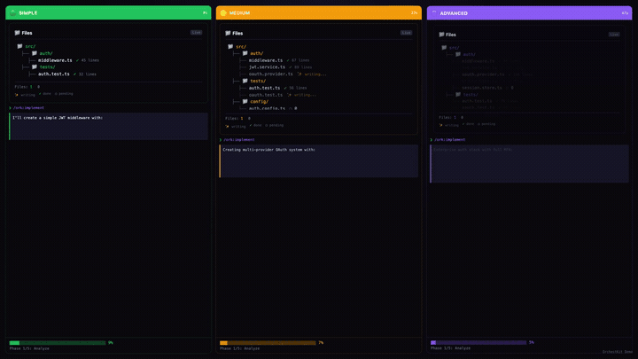

<!-- markdownlint-disable MD033 MD041 -->
<div align="center">

# OrchestKit

### Stop explaining your stack. Start shipping.

**195 skills · 35 agents · 119 hooks · 33 plugins**

[](https://claude.ai/claude-code)
[](./LICENSE)
[](https://github.com/yonatangross/orchestkit)

</div>

---

<p align="center">
  <a href="https://orchestkit.vercel.app/">
    
  </a>
  <br>
  <a href="https://orchestkit.vercel.app/"><strong>🎮 Explore the Playgrounds →</strong></a><br>
  <sub>Interactive marketplace, demo gallery, setup wizard</sub>
</p>

---

## Quick Start

```bash
/plugin marketplace add yonatangross/orchestkit
/plugin install ork
/ork:doctor
```

**That's it.** Skills auto-activate. Hooks protect automatically.

---

## Why OrchestKit?

Every Claude Code session starts from zero. You explain your stack, patterns, preferences—again and again.

OrchestKit gives Claude **persistent knowledge** of production patterns that work automatically:

| Without | With OrchestKit |
|---------|-----------------|
| "Use FastAPI with async SQLAlchemy 2.0..." | "Create an API endpoint" → Done right |
| "Remember cursor pagination, not offset..." | Agents know your patterns |
| "Don't commit to main branch..." | Hooks block bad commits |
| "Run tests before committing..." | `/ork:commit` runs tests for you |

---

## What You Get

| Component | Count | Examples |
|-----------|-------|----------|
| **Skills** | 195 | RAG patterns, FastAPI, React 19, testing, security |
| **Agents** | 35 | backend-architect, frontend-dev, security-auditor |
| **Hooks** | 119 | Pre-commit checks, git protection, quality gates |
| **Plugins** | 33 | Mix and match: `ork-rag`, `ork-fastapi`, `ork-react` |

**[Browse everything in the Playgrounds →](https://orchestkit.vercel.app/marketplace-explorer.html)**

---

## Key Commands

```bash
/ork:implement    # Full-stack implementation with parallel agents
/ork:verify       # 6 agents validate your feature
/ork:commit       # Conventional commit with pre-checks
/ork:explore      # Analyze unfamiliar codebase
/ork:remember     # Save to persistent memory
/ork:doctor       # Health check
```

---

## Install Options

```bash
# Full toolkit (recommended)
/plugin install ork

# Or pick domains
/plugin install ork-rag        # RAG & retrieval
/plugin install ork-fastapi    # FastAPI backend
/plugin install ork-react      # React frontend
/plugin install ork-testing    # Testing patterns
```

**[Setup Wizard →](https://orchestkit.vercel.app/setup-wizard.html)** helps you pick the right plugins.

---

## Configuration

### Optional MCP Servers

```bash
/ork:configure
```

| Server | Purpose |
|--------|---------|
| Context7 | Up-to-date library docs |
| Memory | Knowledge graph |
| Mem0 | Semantic search (needs API key) |

### Environment

```bash
CLAUDE_PROJECT_DIR    # Your project
MEM0_API_KEY          # Optional: Mem0 cloud
```

---

## FAQ

<details>
<summary><strong>Plugin not found?</strong></summary>

```bash
/plugin list
/plugin uninstall ork && /plugin install ork
```
</details>

<details>
<summary><strong>Hooks not firing?</strong></summary>

Run `/ork:doctor` to diagnose.
</details>

<details>
<summary><strong>Claude Code version?</strong></summary>

Requires **≥2.1.27**. Check with `claude --version`.
</details>

---

## Development

```bash
npm run build      # Build plugins from src/
npm test           # Run all tests
```

Edit `src/` and `manifests/`, never `plugins/` (generated).

See [CONTRIBUTING.md](./CONTRIBUTING.md) for details.

---

## What's New

**v5.5.0** — CC 2.1.27, TypeScript hooks, agent-scoped hooks

- 119 TypeScript hooks (91 global + 28 agent-scoped)
- Interactive [Playgrounds](https://orchestkit.vercel.app/)
- Fire-and-forget hook dispatchers

[Full Changelog →](./CHANGELOG.md)

---

<div align="center">

**[Playgrounds](https://orchestkit.vercel.app/)** · **[Issues](https://github.com/yonatangross/orchestkit/issues)** · **[Discussions](https://github.com/yonatangross/orchestkit/discussions)**

MIT License · [@yonatangross](https://github.com/yonatangross)

</div>
