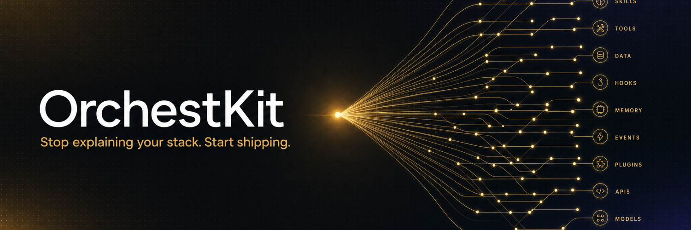

<!-- markdownlint-disable MD033 MD041 -->
<div align="center">



**<!--ork:skills-->114<!--/ork--> skills · <!--ork:agents-->36<!--/ork--> agents · <!--ork:hooks-->217<!--/ork--> hooks**

[](https://claude.ai/claude-code)
[](./LICENSE)
[](https://github.com/yonatangross/orchestkit)
[](https://chat.whatsapp.com/IKgu1xuvKNXHikJ4Qeotpk)
[](https://deepwiki.com/yonatangross/orchestkit)

</div>

---

<p align="center">
  <a href="https://orchestkit.yonyon.ai/"><strong>Explore the Docs →</strong></a> ·
  <a href="https://chat.whatsapp.com/Krraz7LhB951K7nQfC08B2"><strong>OrchestKit Users Group →</strong></a><br>
  <sub>Skill browser, demo gallery, setup wizard</sub>
</p>

---

## Contents

- [Quick Start](#quick-start)
- [Why OrchestKit?](#why-orchestkit)
- [What You Get](#what-you-get)
- [Key Commands](#key-commands)
- [Configuration](#configuration)
- [Install](#install)
- [Release Channels](#release-channels)
- [FAQ](#faq)
- [Development](#development)
- [What's New](#whats-new)
- [Community](#community)


## Quick Start

```bash
/plugin marketplace add yonatangross/orchestkit
/plugin install ork
```

Then start your personalized onboarding:

```bash
/ork:setup
```

The setup wizard scans your codebase, detects your tech stack, recommends skills for your needs, configures MCP servers, and creates a readiness score — all in one command.

---

## Why OrchestKit?

Every Claude Code session starts from zero. You explain your stack, patterns, preferences—again and again.

OrchestKit gives Claude **persistent knowledge** of production patterns that work automatically:

| Without | With OrchestKit |
|---------|-----------------|
| "Use FastAPI with async SQLAlchemy 2.0..." | "Create an API endpoint" → Done right |
| "Remember cursor pagination, not offset..." | Agents know your patterns |
| "Don't commit to main branch..." | Hooks block bad commits |
| "Run tests before committing..." | `/ork:commit` runs tests for you |

---

## What You Get

**One unified plugin, everything included.**

| Component | Details |
|-----------|---------|
| **<!--ork:skills-->114<!--/ork--> Skills** | RAG patterns, FastAPI, React 19, testing, security, database design, ML integration — loaded on-demand, zero overhead |
| **<!--ork:agents-->36<!--/ork--> Agents** | Specialized personas (backend-architect, frontend-dev, security-auditor) — route tasks to the right expert |
| **<!--ork:hooks-->217<!--/ork--> Hooks** | Pre-commit checks, git protection, quality gates, browser safety — ship with confidence |

All available in a single `/plugin install ork`. Skills load on-demand. Hooks work automatically.

**[Browse everything in the Docs →](https://orchestkit.yonyon.ai/docs/skills/overview)**

---

## Key Commands

```bash
/ork:setup        # Personalized onboarding wizard
/ork:implement    # Full-stack implementation with parallel agents
/ork:expect       # Diff-aware AI browser testing
/ork:review-pr    # PR review with parallel agents
/ork:verify       # Multi-agent validation
/ork:commit       # Conventional commit with pre-checks
/ork:explore      # Analyze unfamiliar codebase
/ork:remember     # Save to persistent memory
/ork:doctor       # Health check
```

---

## Configuration

```bash
/ork:configure
```

### Recommended MCP Servers

| Server | Purpose | Required? |
|--------|---------|-----------|
| Context7 | Up-to-date library docs | Recommended |
| Memory | Knowledge graph persistence | Recommended |
| Sequential Thinking | Structured reasoning for subagents | Optional |
| Tavily | Web search and extraction | Optional |

The setup wizard (`/ork:setup`) will recommend MCPs based on your stack.

### Customizing skills

Skills install as files on your disk, but **don't hand-edit the installed copy** — it gets overwritten on update and silently diverges from the canonical playbook. The supported ways to extend (user-level skills, project skills, upstream PRs, or disabling a bundled skill) are in [docs/extending-skills.md](docs/extending-skills.md).

---

## Install

```bash
/plugin install ork
```

No tiering. No version confusion. Just one powerful plugin.

Not on Claude Code? Pull the skills into any agent (Cursor, Codex, OpenCode, …) via [skills.sh](https://skills.sh):

```bash
npx skills add yonatangross/orchestkit
```

---

## Release Channels

| Channel | Stability | Install |
|---------|-----------|---------|
| **Stable** | Production-ready | `/plugin install ork` |
| **Beta** | May have rough edges | See below |
| **Alpha** | Experimental, may break | See below |

To install beta or alpha:

```bash
# Beta channel
/plugin marketplace add yonatangross/orchestkit --ref beta --name orchestkit-beta
/plugin install ork@orchestkit-beta

# Alpha channel
/plugin marketplace add yonatangross/orchestkit --ref alpha --name orchestkit-alpha
/plugin install ork@orchestkit-alpha
```

Run `/ork:doctor` to check which channel you're on. [Full docs](https://orchestkit.yonyon.ai/docs/getting-started/release-channels).

---

## FAQ

<details>
<summary><strong>Plugin not found?</strong></summary>

```bash
/plugin list
/plugin uninstall ork && /plugin install ork
```
</details>

<details>
<summary><strong>Hooks not firing?</strong></summary>

Run `/ork:doctor` to diagnose.
</details>

<details>
<summary><strong>Claude Code version?</strong></summary>

Requires **≥2.1.206** (supported floor; Opus 4.8, `xhigh` effort, dynamic workflows, `sandbox.network.deniedDomains`, native binary, hardened `Bash(rm:*)`/`Bash(find:*)` rules). Check with `claude --version`.
</details>

---

## Development

```bash
npm run build      # Build plugins from src/
npm test           # Run all tests
```

Edit `src/` and `manifests/`, never `plugins/` (generated).

See [CONTRIBUTING.md](./CONTRIBUTING.md) for details.

---

## What's New

<!--ork:whats-new-->
<!-- AUTO-GENERATED from CHANGELOG.md by scripts/stamp-whats-new.mjs — do not hand-edit between the ork:whats-new markers. -->
<!-- Regenerated on `npm run build`; CI (`--check`) fails if this is stale. Full history: [CHANGELOG.md](CHANGELOG.md). -->

**[v8.84.10](https://github.com/yonatangross/orchestkit/compare/v8.84.9...v8.84.10)** · 2026-07-23

- **ci:** drop the What's New freshness gate blocking the PR queue (#3118)
- **deps:** bump the npm-minor-patch group across 1 directory with 4 updates (#3111)
- **deps:** bump the remotion group across 1 directory with 21 updates (#3110)
- bump the github-actions group across 1 directory with 6 updates (#3112)

**[v8.84.9](https://github.com/yonatangross/orchestkit/compare/v8.84.8...v8.84.9)** · 2026-07-23

- **ci:** scope What's New --check to PRs, refresh for 8.84.8 (#3113)
- **review:** allow the release bot to trigger a review (#3114)
- **review:** skip auto-label on Dependabot PRs (no secret access) (#3116)

**[v8.84.8](https://github.com/yonatangross/orchestkit/compare/v8.84.7...v8.84.8)** · 2026-07-23

- **hooks:** stop denying local data piped to an interpreter (#3097)
- **security:** remove privesc in release regen, tighten allowlist (#3102)
- **demos:** make renderer check gate-able, split remotion bumps (#3105)
- **review:** auto-run Claude review on sensitive PRs, ban dead gates (#3104)

**[v8.84.7](https://github.com/yonatangross/orchestkit/compare/v8.84.6...v8.84.7)** · 2026-07-23

- **demos:** repair the Remotion renderer, validate it pre-merge (#3099)

**[v8.84.6](https://github.com/yonatangross/orchestkit/compare/v8.84.5...v8.84.6)** · 2026-07-23

- **cc-watch:** snapshot upstream CHANGELOG (2.1.218) (#3094)
- **readme:** auto-generate What's New from CHANGELOG (#3096)

**[v8.84.5](https://github.com/yonatangross/orchestkit/compare/v8.84.4...v8.84.5)** · 2026-07-22

- **ci:** scope Claude workflow tools, gate triage on author (#3085)
- **security:** audit all four trees in CI, pin sharp (#3090)
- **security:** correct audit-gate id reporting, allowlist hono (#3087)

**[v8.84.4](https://github.com/yonatangross/orchestkit/compare/v8.84.3...v8.84.4)** · 2026-07-22

- **skills:** burn model-recency ratchet to zero (#3056)

**[v8.84.3](https://github.com/yonatangross/orchestkit/compare/v8.84.2...v8.84.3)** · 2026-07-22

- **hook-contract:** bump to 0.1.2, domain-anchored SDK provenance (#3080)
- pin npm to 11.x in the hook-contract publish job (#3082)

_See [CHANGELOG.md](CHANGELOG.md) for the full release history._
<!--/ork-->

---

## Community

Join the **Code with Yonatan** community for AI dev tips, OrchestKit support, and connecting with other builders:

| Group | Link |
|-------|------|
| **Community** (all channels) | [Join on WhatsApp](https://chat.whatsapp.com/IKgu1xuvKNXHikJ4Qeotpk) |
| **AI Dev (EN)** | [English Group](https://chat.whatsapp.com/CFAQoyGl2rp4P3JHcwC9Uu) |
| **יש לך AI?** | [Hebrew Group](https://chat.whatsapp.com/BC4QoLEUNR76ygZwyrgZZT) |
| **OrchestKit Users** | [Support & Showcase](https://chat.whatsapp.com/Krraz7LhB951K7nQfC08B2) |

---

<div align="center">

**[Docs](https://orchestkit.yonyon.ai/)** · **[Issues](https://github.com/yonatangross/orchestkit/issues)** · **[Discussions](https://github.com/yonatangross/orchestkit/discussions)** · **[Community](https://chat.whatsapp.com/IKgu1xuvKNXHikJ4Qeotpk)**

MIT License · [@yonatangross](https://github.com/yonatangross)

</div>
