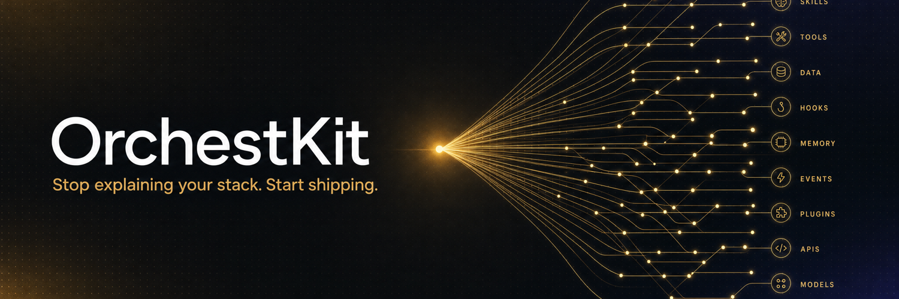

<!-- markdownlint-disable MD033 MD041 -->
<div align="center">



**<!--ork:skills-->114<!--/ork--> skills · <!--ork:agents-->36<!--/ork--> agents · <!--ork:hooks-->219<!--/ork--> hooks**

[](https://claude.ai/claude-code)
[](./LICENSE)
[](https://github.com/yonatangross/orchestkit)
[](https://yonyon.ai/go/community)
[](https://deepwiki.com/yonatangross/orchestkit)

[](https://mcptoplist.com/server/io.github.yonatangross%2Forchestkit)

</div>

---

<p align="center">
  <a href="https://orchestkit.yonyon.ai/"><strong>Explore the Docs →</strong></a> ·
  <a href="https://yonyon.ai/go/orchestkit"><strong>OrchestKit Community →</strong></a><br>
  <sub>Skill browser, demo gallery, setup wizard</sub>
</p>

---

## Contents

- [Quick Start](#quick-start)
- [Why OrchestKit?](#why-orchestkit)
- [What You Get](#what-you-get)
- [Key Commands](#key-commands)
- [Configuration](#configuration)
- [Install](#install)
- [FAQ](#faq)
- [Development](#development)
- [What's New](#whats-new)
- [Community](#community)


## Quick Start

```bash
/plugin marketplace add yonatangross/orchestkit
/plugin install ork
```

Then start your personalized onboarding:

```bash
/ork:setup
```

The setup wizard scans your codebase, detects your tech stack, recommends skills for your needs, configures MCP servers, and creates a readiness score — all in one command.

---

## Why OrchestKit?

Every Claude Code session starts from zero. You explain your stack, patterns, preferences—again and again.

OrchestKit gives Claude **persistent knowledge** of production patterns that work automatically:

| Without | With OrchestKit |
|---------|-----------------|
| "Use FastAPI with async SQLAlchemy 2.0..." | "Create an API endpoint" → Done right |
| "Remember cursor pagination, not offset..." | Agents know your patterns |
| "Don't commit to main branch..." | Hooks block bad commits |
| "Run tests before committing..." | `/ork:commit` runs tests for you |

---

## What You Get

**One unified plugin, everything included.**

| Component | Details |
|-----------|---------|
| **<!--ork:skills-->114<!--/ork--> Skills** | RAG patterns, FastAPI, React 19, testing, security, database design, ML integration — loaded on-demand, zero overhead |
| **<!--ork:agents-->36<!--/ork--> Agents** | Specialized personas (backend-architect, frontend-dev, security-auditor) — route tasks to the right expert |
| **<!--ork:hooks-->219<!--/ork--> Hooks** | Pre-commit checks, git protection, quality gates, browser safety — ship with confidence |

All available in a single `/plugin install ork`. Skills load on-demand. Hooks work automatically.

**[Browse everything in the Docs →](https://orchestkit.yonyon.ai/docs/skills/overview)**

---

## Key Commands

```bash
/ork:auto         # Front door: describe a goal, it routes to the right skill
/ork:setup        # Personalized onboarding wizard
/ork:implement    # Full-stack implementation with parallel agents
/ork:expect       # Diff-aware AI browser testing
/ork:review-pr    # PR review with parallel agents
/ork:verify       # Multi-agent validation
/ork:commit       # Conventional commit with pre-checks
/ork:explore      # Analyze unfamiliar codebase
/ork:remember     # Save to persistent memory
/ork:doctor       # Health check
```

---

## Configuration

`/ork:setup` detects your stack, recommends MCP servers, and writes the configuration for you.

### Recommended MCP Servers

| Server | Purpose | Required? |
|--------|---------|-----------|
| Context7 | Up-to-date library docs | Recommended |
| Memory | Knowledge graph persistence | Recommended |
| Sequential Thinking | Structured reasoning for subagents | Recommended |
| Tavily | Web search and extraction | Optional |

Set `"alwaysLoad": true` on the first three in your `.mcp.json`. It skips the per-skill tool probe and shaves ~150ms off cold starts.

### Customizing skills

Skills install as files on your disk, but **don't hand-edit the installed copy** — it gets overwritten on update and silently diverges from the canonical playbook. The supported ways to extend (user-level skills, project skills, upstream PRs, or disabling a bundled skill) are in [docs/extending-skills.md](docs/extending-skills.md).

---

## Install

```bash
/plugin install ork
```

No tiering. No version confusion. Just one powerful plugin.

Not on Claude Code? Pull the skills into any agent (Cursor, Codex, OpenCode, …) via [skills.sh](https://skills.sh):

```bash
npx skills add yonatangross/orchestkit
```

---

## FAQ

<details>
<summary><strong>Plugin not found?</strong></summary>

```bash
/plugin list
/plugin uninstall ork && /plugin install ork
```
</details>

<details>
<summary><strong>Hooks not firing?</strong></summary>

Run `/ork:doctor` to diagnose.
</details>

<details>
<summary><strong>Claude Code version?</strong></summary>

Requires **≥2.1.220** (supported floor; Opus 5 as the default Opus, `xhigh` effort, dynamic workflows, `sandbox.network.strictAllowlist`, native binary, hardened `Bash(rm:*)`/`Bash(find:*)` rules). Check with `claude --version`.

Raising this floor is a breaking change and ships as a major release. See [STABILITY.md](STABILITY.md) for the full contract, and `shared/cc-support.json` for the authoritative window.
</details>

---

## Development

```bash
npm run build      # Build plugins from src/
npm test           # Run all tests
```

Edit `src/` and `manifests/`, never `plugins/` (generated).

See [CONTRIBUTING.md](./CONTRIBUTING.md) for details.

---

## What's New

<!--ork:whats-new-->
<!-- AUTO-GENERATED from CHANGELOG.md by scripts/stamp-whats-new.mjs — do not hand-edit between the ork:whats-new markers. -->
<!-- Regenerated on `npm run build`; CI (`--check`) fails if this is stale. Full history: [CHANGELOG.md](CHANGELOG.md). -->

**[v9.1.1](https://github.com/yonatangross/orchestkit/compare/v9.1.0...v9.1.1)** · 2026-07-26

- sync README and changelog data to v9.1.0 (#3167)

**[v9.1.0](https://github.com/yonatangross/orchestkit/compare/v9.0.2...v9.1.0)** · 2026-07-26

- retro-hardening mechanisms 5+6 (invocability check, byte-budget guard) (#3161)
- **viz:** re-anchor visual-style rule + quickviz on-ramp (#3164)
- **viz:** stop throttling explicit visual asks (#3166)

**[v9.0.2](https://github.com/yonatangross/orchestkit/compare/v9.0.1...v9.0.2)** · 2026-07-26

- **ci:** remove the Claude PR Review workflow and its labeler (#3159)

**[v9.0.1](https://github.com/yonatangross/orchestkit/compare/v9.0.0...v9.0.1)** · 2026-07-26

- bound rotated analytics archives, unstale the CC floor (#3156)
- **build:** default-deny frontmatter gate, pass all 10 fields (#3158)
- **readme:** refresh What's New for 9.0.0 and isolate the RTL table cell (#3153)
- **cc-watch:** snapshot upstream CHANGELOG (2.1.220) (#3155)

**[v9.0.0](https://github.com/yonatangross/orchestkit/compare/v8.85.0...v9.0.0)** · 2026-07-25

- **cc:** the Claude Code support floor is now 2.1.220. Claude Code 2.1.206 through 2.1.219 are no longer supported; hooks and skills may no-op or error on them, and that is not treated as a bug. Upgrade Claude Code before updating OrchestKit.
- **cc:** adopt Opus 5, strict-renew the support floor to 2.1.220 (#3141)
- **verify:** add the Reachability Proof axis (REACHED vs UNREACHED) (#3149)
- **docs:** pin playground links to the commit SHA, not the branch (#3148)
- **hooks:** bound hook-timing.jsonl, the one analytics file with no cap (#3151)
- …and 1 more (see [CHANGELOG.md](CHANGELOG.md))

**[v8.85.0](https://github.com/yonatangross/orchestkit/compare/v8.84.10...v8.85.0)** · 2026-07-25

- agent activation routing (M170) (#3133)
- 3 defects found by /ork:assess on the M170 diff (#3136)
- **build:** stop dropping argument-hint from generated commands (#3146)
- **hooks:** make network-egress-guard DENY tier quote-aware (#3124)
- **hooks:** redirect pipe-to-interpreter deny instead of dead-ending (#3121)
- …and 8 more (see [CHANGELOG.md](CHANGELOG.md))

**[v8.84.10](https://github.com/yonatangross/orchestkit/compare/v8.84.9...v8.84.10)** · 2026-07-23

- **ci:** drop the What's New freshness gate blocking the PR queue (#3118)
- **deps:** bump the npm-minor-patch group across 1 directory with 4 updates (#3111)
- **deps:** bump the remotion group across 1 directory with 21 updates (#3110)
- bump the github-actions group across 1 directory with 6 updates (#3112)

**[v8.84.9](https://github.com/yonatangross/orchestkit/compare/v8.84.8...v8.84.9)** · 2026-07-23

- **ci:** scope What's New --check to PRs, refresh for 8.84.8 (#3113)
- **review:** allow the release bot to trigger a review (#3114)
- **review:** skip auto-label on Dependabot PRs (no secret access) (#3116)

_See [CHANGELOG.md](CHANGELOG.md) for the full release history._
<!--/ork-->

---

## Community

Join the **Building with AI** community for AI dev tips, OrchestKit support, and connecting with other builders:

| Room | Who it's for | Link |
|------|--------------|------|
| **Building with AI** | The umbrella community. One join, every room below. | [Join](https://yonyon.ai/go/community) |
| **Builders** | For people already building | [Join](https://yonyon.ai/go/builders) |
| **OrchestKit** | For OrchestKit users | [Join](https://yonyon.ai/go/orchestkit) |
| **AI for Business** | For people leading AI adoption | [Join](https://yonyon.ai/go/business) |

Names and audiences match what [yonyon.ai](https://yonyon.ai/en) renders, so the two surfaces cannot drift. Every link resolves through `yonyon.ai/go/*`, so a rotated invite never needs a README change and no raw invite is published here.

---

<div align="center">

**[Docs](https://orchestkit.yonyon.ai/)** · **[Issues](https://github.com/yonatangross/orchestkit/issues)** · **[Discussions](https://github.com/yonatangross/orchestkit/discussions)** · **[Community](https://yonyon.ai/go/community)**

MIT License · [@yonatangross](https://github.com/yonatangross)

</div>
