# Retro-Hardening Plan — Diagrams & Provenance

Source-of-truth Mermaid for the 6 mechanisms rendered as an interactive dashboard in
`plan-viz.html`. Every BEFORE diagram traces a real incident from this session's
`compaction-summary.txt` and verified repo state (not hypothetical). Every AFTER diagram
shows where the proposed control intercepts the same chain.

> **Mermaid gotcha:** `classDef` colors below are **hex**, never `hsl()` — `hsl()` breaks
> when these diagrams are re-rendered inside an HTML playground. The playground itself
> (`plan-viz.html`) does not embed the Mermaid runtime (zero external deps per
> `playground-visual-standard.md` — same precedent as `decision-router.template.html`,
> which replaced Mermaid with inline SVG); these are the authored source diagrams.

Verdict legend: 🟢 SHIP · 🟡 PARK · 🔴 KILL

---

## Status after correctness assessment (2026-07-26, /ork:assess correctness, 6.0/10)

A dedicated correctness pass over this plan (pre-implementation) revised the board.
Full findings live in the assess transcript; the load-bearing deltas:

| # | Was | Now | Why |
|---|-----|-----|-----|
| 5 | 🟢 SHIP | ✅ **BUILT** | `bin/check-skill-invocable.sh`, 6-link chain check, mutation-verified (stale-build flip caught by `--all`). |
| 6 | 🟢 SHIP | ✅ **BUILT** | `pretool/write-edit/context-file-budget-guard.ts`, 12 tests, wired at all 3 points (see below). |
| 1 | 🟢 SHIP | 🟡 **PAPER FIRST** | Self-contradiction: the design forbids network calls in-hook (<50ms budget) but its own decision gate ("queue already deep") is only knowable via `gh api`. As written it is either a blanket ASK on every `gh run cancel|rerun` (false-positive heavy for routine CI use) or it needs the call it forbids. ALSO: a verbatim sync of personal patterns #12/#13 into the public repo would leak HQ-private detail (org names, PR numbers, credential-rotation steps) — the sync needs a genericization pass, not a copy. |
| 3 | 🟢 SHIP | 🔴 **REDESIGN** | No data source: the WorktreeCreate `HookInput` carries only `project_dir` + `worktree_name`, and `project_dir` IS the wrong value in the incident this guard targets. No `expected_repo` field exists anywhere in the contract. The guard likely belongs at `PreToolUse:Task` dispatch time (where declared intent still exists), not at worktree provisioning. Plus unhandled edge cases: forks (origin legitimately differs), no-remote repos (skip-not-refuse), bare worktrees. |

**Wiring correction the assess caught (applies to any future hook here):** registration
is **3-point**, not 2-point — `hooks.json` (dispatcher only) + `entries/<event>.ts`
import-and-map + **the dispatcher's internal array** (`WRITE_EDIT_HOOKS[]` /
`BASH_HOOKS[]`). A hook present in the first two but absent from the array never runs:
the #959 dead-hook class one layer deeper than the checklist guarded.

---

## Pipeline provenance


The fact-check step matters on its own: the brainstorm draft cited the ci-debug playbook
at "11 patterns"; the live file (`~/.claude/skills/ci-debug/SKILL.md`) is actually at
**13** (row 13 = `Runner-pool starvation misread as CI failure`, added THIS session).
Confirmed by grepping the table directly rather than trusting the draft's count.

---

## Mechanism 1 — 🟢 SHIP — ci-debug fork-sync + ASK hook on `gh run cancel|rerun`/`update-branch`

**Measured damage:** 4 self-inflicted supersessions on platform PR #9083 (ci-debug
pattern #13, dated 2026-07-26): "Both `update-branch` and `gh run rerun` queue a NEW
request into the same branch concurrency group, which cancels the run you are waiting
for and sends it to the BACK of the queue" — oldest queued run landed 2h+ behind a
36-deep backlog on 6 runners.

### BEFORE — the self-inflicted stall

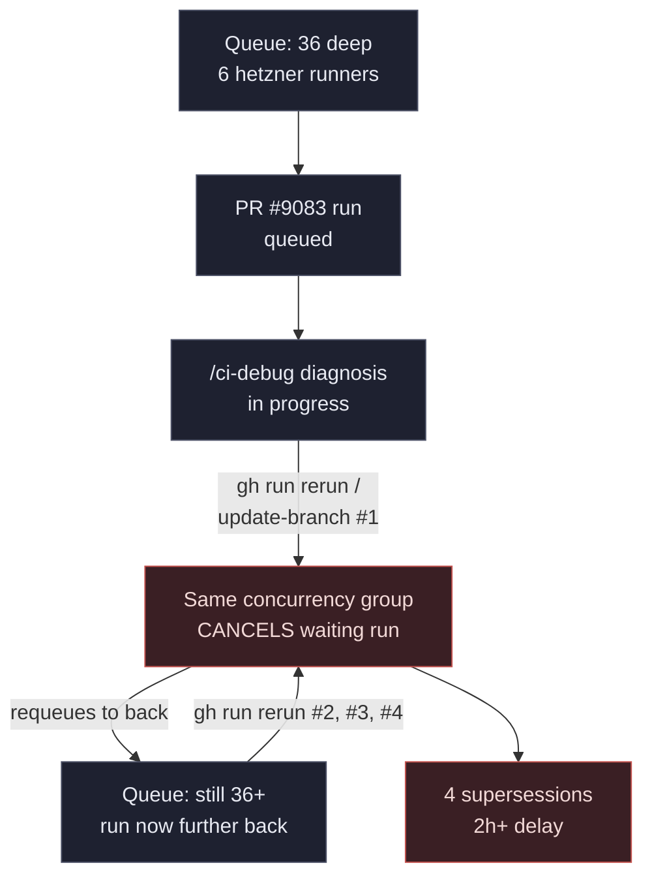

### AFTER — ASK hook intercepts the mutating call

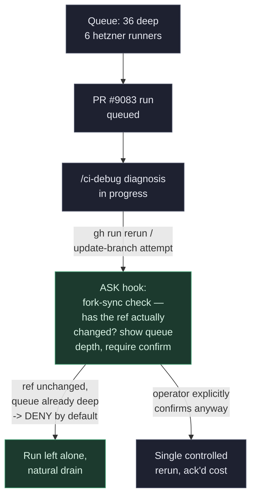

---

## Mechanism 2 — 🟡 PARK — PR evidence-gate (needs bounded spec)

**Measured damage (two incidents, same root cause — asserted before verified):**
- **$0-exposure claim:** initially reported a "live 19x production leak since 12:07Z"
  for Opus-5 pricing. A real Langfuse query showed **ZERO** `claude-opus-5` traces at
  any window (1d/7d/30d/90d) — actual exposure was **$0**. Self-corrected only after
  running the query.
- **13,250 vs 1,312 miscount:** a Langfuse purge-scope recommendation cited 1,312
  traces; the user pushed back ("why purge them? not useful? explain"), forcing
  re-investigation that found the real scope was **13,250** (10x off) — and that the
  producer bug was still actively creating ~1,924 new inflated traces in the prior
  2 days alone, meaning a purge then would have refilled immediately.

### BEFORE — claim ships ahead of the query

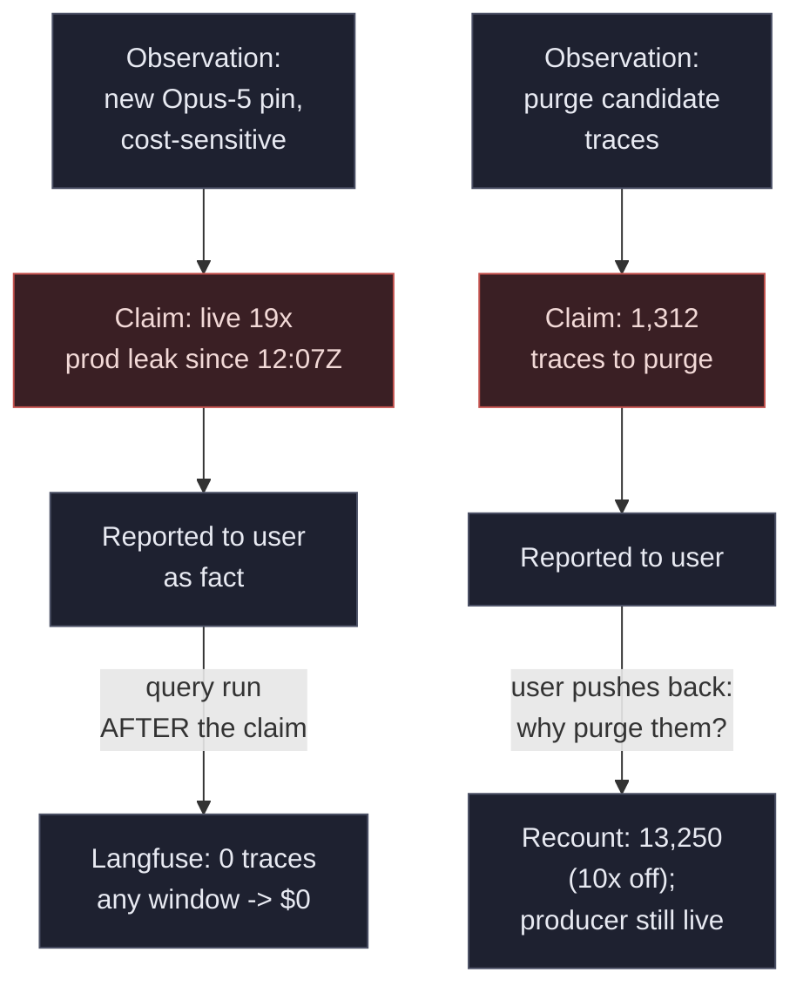

### AFTER — evidence-gate blocks the unverified claim (shape only — spec not bounded yet)

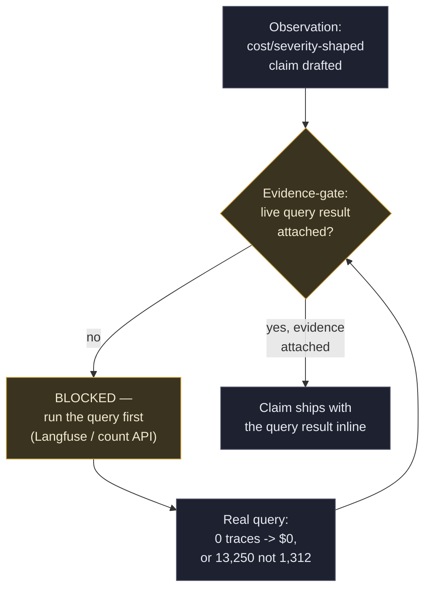

**Why PARK, not SHIP:** the mechanism shape is right, but "which claims are gated",
"what counts as evidence", and "how it composes with existing hooks" are undefined —
shipping now would either gate nothing (too narrow) or block routine status updates
(too broad).

---

## Mechanism 3 — 🟢 SHIP — worktree repo-identity guard at `worktree-provisioner.ts:209`

**Measured damage:** 2 of 3 dispatched `ork:` subagents (`ork:monitoring-engineer`,
`ork:llm-integrator`) spawned worktrees in the **wrong repository** (orchestkit,
instead of the intended platform/core), burned ~101k + ~127k ≈ **230k tokens**,
returned single-sentence non-answers, and left stray detached-HEAD worktrees with
0 commits / 0 dirty files.

Verified root cause — `src/hooks/src/worktree/worktree-provisioner.ts:209`:

```ts
const worktreePath = join(projectDir, '.worktrees', name);
```

`projectDir` (line 208) is `input.project_dir || process.cwd()` — accepted with no
check that it matches the repo the calling agent actually intends to target.

### BEFORE — no identity check at provisioning time

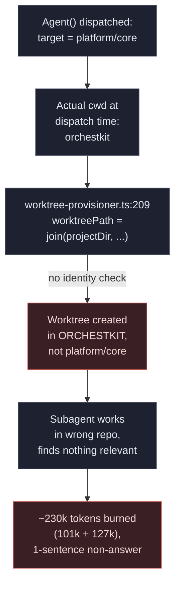

### AFTER — repo-identity guard refuses the mismatch

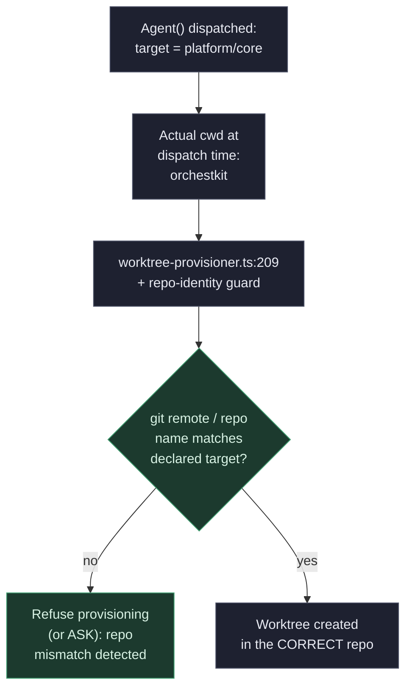

---

## Mechanism 4 — 🔴 KILL — display-lint circuit-breaker

**Context, not a fresh incident:** `display-lint`'s advisory nudge fired repeatedly
during THIS session alone (visible live in this task's own tool calls — 6+ separate
"[display-lint] N chars across M stages" notices). The proposed mechanism is a
per-session circuit-breaker that auto-suppresses the nudge after N repeats.

Issue **#2947** (`fix(hooks): display-lint counts quoted content and escaped operators
as shell stages`, state: CLOSED) already documents the real defect: `display-lint.ts`
reuses `normalizeCommand()` — a **security** primitive built to see through quoting —
for a **cosmetic** stage count, so quoted `|`/`;`/`&&` and escaped `\|` get counted as
real stages, manufacturing false positives (e.g. a single-stage `python3 -c "..."`
denied as "7 stages").

### BEFORE — noise treated as a volume problem

```mermaid
flowchart TD
    CMD["Bash command with\nquoted operators\n(python3 -c \"...\")"] --> LINT["display-lint.ts:63\nreuses normalizeCommand()\n(security primitive)"]
    LINT -->|"quoted content\ncounted as stages"| FALSEPOS["False positive:\n1 real stage counted\nas 7"]
    FALSEPOS --> NUDGE["Advisory nudge\nfires repeatedly"]
    NUDGE --> PROPOSAL["Proposed fix:\ncircuit-breaker to\nsuppress after N nudges"]

    classDef bad fill:#3a1f24,stroke:#c4534f,color:#f2d9d7,stroke-width:1px;
    classDef neutral fill:#1e2130,stroke:#4c5166,color:#e8eaf2,stroke-width:1px;
    class FALSEPOS,PROPOSAL bad;
    class CMD,LINT,NUDGE neutral;
```

### AFTER (killed) — a breaker on top of a broken counter is the wrong layer

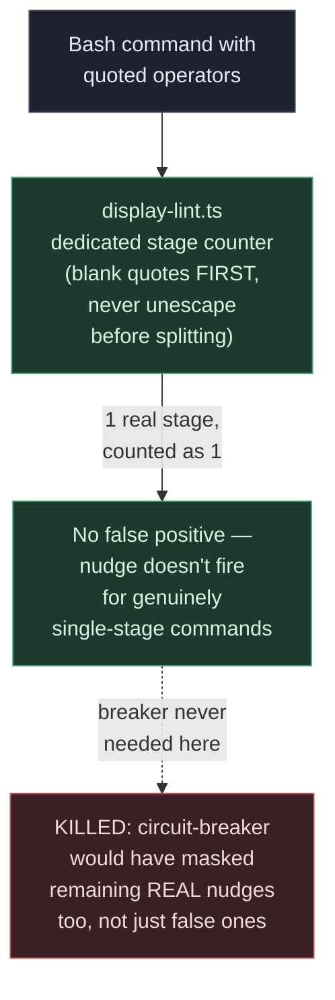

**Why KILL:** the fix belongs in `countDisplayStages()` (blank quoted regions before
splitting, per `#2947`'s own proposed patch), not in a breaker that would silence
correct 3-real-stage denials along with the false ones. A breaker also does nothing
for the underlying miscount — the next session hits the same false positives, just
quieter about it.

---

## Mechanism 5 — 🟢 SHIP — `bin/check-skill-invocable.sh`

**Measured damage:** confirming whether `/hq-ext:handoff` was a real, invocable skill
took 3 separate lookups this session — `find ~/.claude/plugins ~/.claude/skills
-iname '*handoff*'`, a grep for `'Previous Session Handoff'`, and a manual scan of the
enumerated available-skills list — and still ended **ambiguous**: only a marketplace
directory (`plugins/marketplaces/yonatan-hq/skills/handoff`) and an unrelated
`validate-handoffs.sh` script turned up, with no confirmation the slash command
actually resolves.

### BEFORE — ad hoc filesystem archaeology, inconclusive

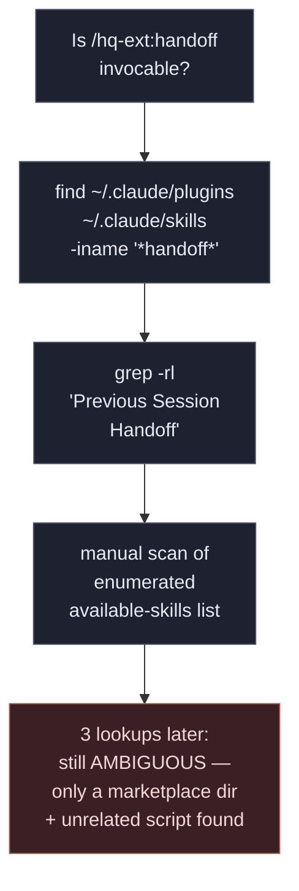

### AFTER — one deterministic check

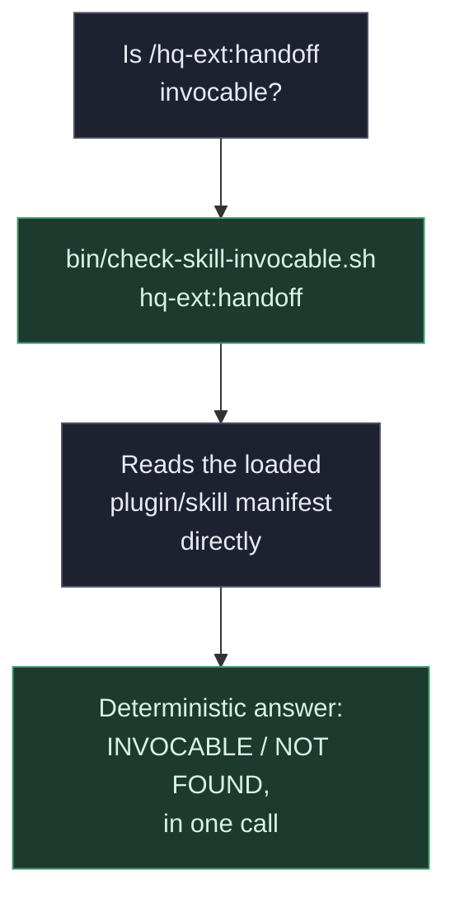

---

## Mechanism 6 — 🟢 SHIP — pre-write byte-budget hook on `MEMORY.md`/`CLAUDE.md`

**Measured damage:** `MEMORY.md` was flagged by the PostToolUse hook as exceeding its
140-line target (measured at 180 lines / 176 memory files mid-session; 175 lines /
173 files at time of writing) **repeatedly across the whole session**, with zero
corrective action taken — `/ork:dream` compaction was explicitly deferred multiple
times as "not something to do mid-task", because the warning was advisory-only and
trivially easy to defer.

### BEFORE — advisory warning, no enforcement, ignored all session

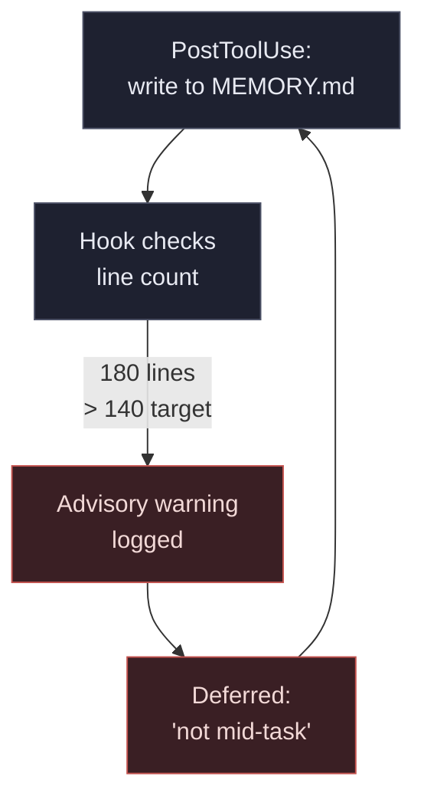

### AFTER — pre-write hard gate

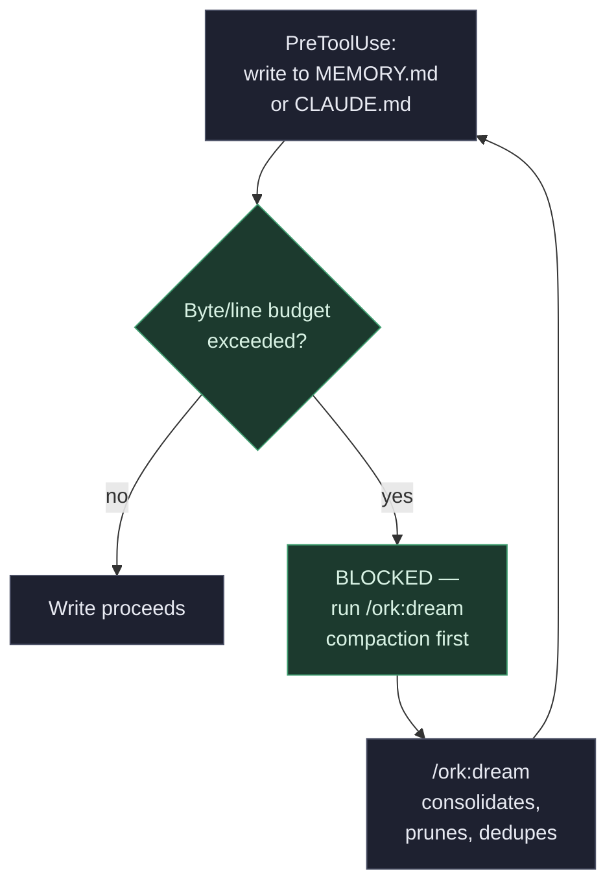

---

## Scoreboard

| # | Mechanism | Verdict | Measured damage cited |
|---|-----------|---------|------------------------|
| 1 | ci-debug fork-sync + ASK hook on `gh run cancel/rerun`/`update-branch` | 🟢 SHIP | 4 self-inflicted supersessions (ci-debug pattern #13) |
| 2 | PR evidence-gate | 🟡 PARK — needs bounded spec | $0-exposure claim; 13,250 vs 1,312 miscount |
| 3 | worktree repo-identity guard (`worktree-provisioner.ts:209`) | 🟢 SHIP | ~230k tokens wasted (101k + 127k) in wrong-repo worktrees |
| 4 | display-lint circuit-breaker | 🔴 KILL — retreads #2947 | none fresh — duplicates tracked issue |
| 5 | `bin/check-skill-invocable.sh` | 🟢 SHIP | 3 ambiguous lookups for `/hq-ext:handoff` |
| 6 | pre-write byte-budget hook (`MEMORY.md`/`CLAUDE.md`) | 🟢 SHIP | 180/140 lines, ignored all session |

**Note on target directory:** RESOLVED — branch `feat/retro-hardening-2026-07-26` was
cut and this directory renamed to `docs/feat--retro-hardening-2026-07-26/` to match the
PR Playground CI gate's expected path (`/` in the branch name replaced by `--`).
