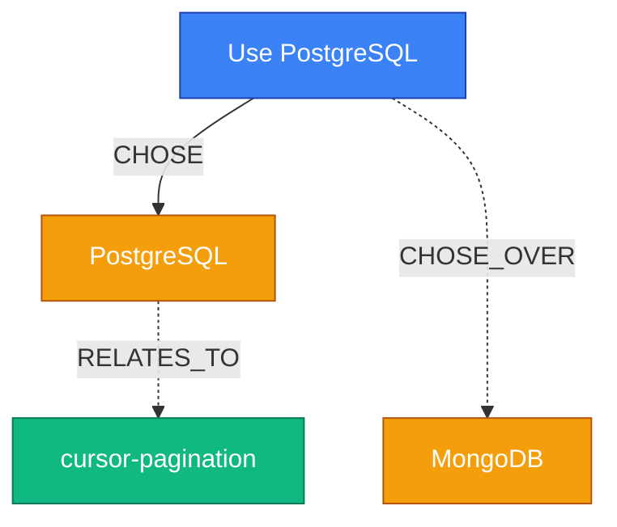
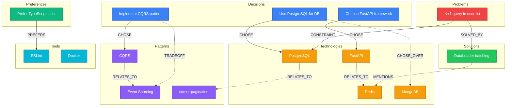
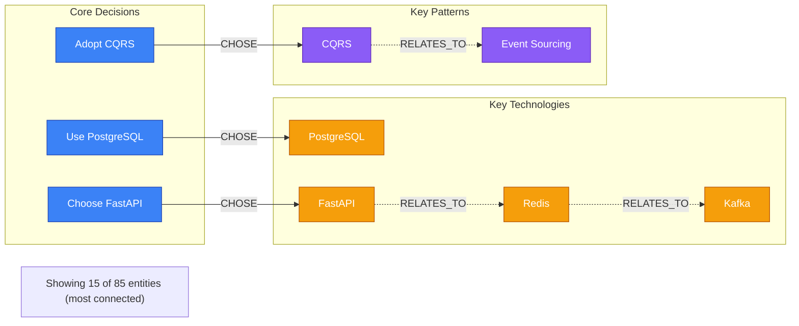

<span className="badge badge-blue">Command</span> <span className="badge badge-green">low</span>


# Memory - Read & Access Operations

Unified read-side memory skill with subcommands for searching, loading, syncing, history, and visualization.

## Usage

```bash
/ork:memory search <query>  # Search knowledge graph
/ork:memory load             # Load context at session start
/ork:memory history          # View decision timeline
/ork:memory viz              # Visualize knowledge graph
/ork:memory status           # Show memory system health
```

---

## CRITICAL: Use AskUserQuestion When No Subcommand

If invoked without a subcommand, ask the user what they want:

```python
AskUserQuestion(
  questions=[{
    "question": "What memory operation do you need?",
    "header": "Operation",
    "options": [
      {"label": "search", "description": "Search decisions and patterns in knowledge graph"},
      {"label": "load", "description": "Load relevant context for this session"},
      {"label": "history", "description": "View decision timeline"},
      {"label": "viz", "description": "Visualize knowledge graph as Mermaid"},
      {"label": "status", "description": "Check memory system health"}
    ],
    "multiSelect": false
  }]
)
```

---

## Subcommands

See [Memory Commands Reference](references/memory-commands.md) for full usage, flags, output formats, and context-aware result limits for each subcommand.

| Subcommand | Purpose |
|------------|---------|
| `search` | Search past decisions, patterns, entities. Supports `--category`, `--limit`, `--agent`, `--global` filter flags |
| `load` | Auto-load relevant memories at session start. Supports `--project`, `--global` |
| `history` | Decision timeline with table, Mermaid, or JSON output. Supports `--since`, `--mermaid` |
| `viz` | Render knowledge graph as Mermaid diagram. See also [mermaid-patterns.md](references/mermaid-patterns.md) |
| `status` | Memory system health check |

---

## Workflow

### 1. Parse Subcommand
```
Extract first argument as subcommand
If no subcommand -> AskUserQuestion
Validate subcommand is one of: search, load, history, viz, status
Parse remaining flags
```

### 2. Execute Subcommand
Route to appropriate handler based on subcommand.

### 3. Report Results
Format output appropriate to the operation.

---

## Rules Quick Reference

| Rule | Impact | What It Covers |
|------|--------|----------------|
| [entity-extraction-patterns](rules/entity-extraction-patterns.md) | HIGH | Entity types, relation types, graph query semantics |
| [deduplication-strategy](rules/deduplication-strategy.md) | HIGH | Edit-over-Write pattern, anchor-based insertion, verification |

---

## Session Resume

See [Session Resume Patterns](references/session-resume-patterns.md) for CC 2.1.31 resume hints, context capture before ending, and resume workflows for PRs, issues, and implementations.

---

## Related Skills

- `ork:remember` - Store decisions and patterns (write-side)

---

## Error Handling

- If graph empty for viz: Show helpful message about using /ork:remember
- If subcommand invalid: Show usage help
- If memory files corrupt: Report and offer repair
- If search query empty: Show recent entities instead
- If no search results: Suggest alternatives


---

## Rules (2)

### Deduplication Strategy — medium


# Deduplication Strategy

When loading or searching memories, prevent duplicate context injection.

## Rules

1. **Edit over Write** -- When updating `.claude/memory/MEMORY.md` or project memory files, prefer `Edit` over `Write` to preserve existing content and avoid accidental overwrites.

2. **Anchor-based insertion** -- Always verify the target section header exists before inserting:
   - `## Recent Decisions`
   - `## Patterns`
   - `## Preferences`
   - `## Detailed Notes`

3. **Surgical edits** -- Use `Edit(file_path, old_string=anchor_line, new_string=anchor_line + "\n" + new_content)` to append under a section header without overwriting the rest.

4. **Verify after edit** -- Always `Read(file_path)` after editing to confirm the edit applied correctly.

## Why Edit Over Write

| Approach | Risk | Permission |
|----------|------|-----------|
| Write (overwrite) | Loses existing content if template incomplete | Requires approval |
| Edit (surgical) | Only modifies target section | Often auto-approved |

## Hook Exception

The `memory-writer.ts` hook uses Node.js `writeFileSync` -- this is correct for hooks context where full file control is needed. The Edit pattern above is for agent-side SKILL.md operations.


### Entity Extraction Patterns — medium


# Entity Extraction Patterns

When searching or visualizing the knowledge graph, recognize these entity types and their typical observations.

## Entity Types

| Type | Examples | Typical Observations |
|------|----------|---------------------|
| `Technology` | pgvector, PostgreSQL, React | Version, use case, project association |
| `Agent` | database-engineer, backend-system-architect | Capabilities, scope, assigned tasks |
| `Pattern` | cursor-pagination, connection-pooling | When to use, trade-offs, implementation notes |
| `Decision` | "Use PostgreSQL for DB" | Rationale, alternatives considered, date |
| `Project` | Project-specific context | Stack, status, team, constraints |
| `AntiPattern` | Failed or abandoned patterns | Why it failed, what replaced it |
| `Constraint` | Budget, timeline, compliance | Source, severity, workarounds |
| `Preference` | "Prefer TypeScript strict" | Strength, scope, exceptions |

## Relation Types

| Relation | Semantic | Arrow Style |
|----------|----------|-------------|
| USES | Active dependency | Solid |
| RECOMMENDS | Suggested approach | Solid |
| REQUIRES | Hard dependency | Solid |
| ENABLES | Unlocks capability | Solid |
| PREFERS | Stated preference | Solid |
| CHOSE_OVER | Rejected alternative | Dashed |
| USED_FOR | Purpose link | Solid |
| CONFLICTS_WITH | Incompatibility | Dashed |


---

## References (3)

### Memory Commands

# Memory Subcommand Reference

Complete usage, flags, and output format details for each `/ork:memory` subcommand.

## `search` - Search Knowledge Graph

Search past decisions, patterns, and entities from the knowledge graph.

**Usage:**
```bash
/ork:memory search <query>                    # Search knowledge graph
/ork:memory search --category <cat> <query>   # Filter by category
/ork:memory search --limit <n> <query>        # Limit results (default: 10)
/ork:memory search --agent <agent-id> <query> # Filter by agent scope
/ork:memory search --global <query>           # Search cross-project best practices
```

**Flags:**

| Flag | Behavior |
|------|----------|
| (default) | Search graph |
| `--limit &lt;n&gt;` | Max results (default: 10) |
| `--category &lt;cat&gt;` | Filter by category |
| `--agent &lt;agent-id&gt;` | Filter results to a specific agent's memories |
| `--global` | Search cross-project best practices |

**Context-Aware Result Limits:**

Result limits automatically adjust based on `context_window.used_percentage`:

| Context Usage | Default Limit | Behavior |
|---------------|---------------|----------|
| 0-70% | 10 results | Full results with details |
| 70-85% | 5 results | Reduced, summarized results |
| >85% | 3 results | Minimal with "more available" hint |

**Search Workflow:**

1. Parse flags (--category, --limit, --agent, --global)
2. Build filters from flags:
   ```
   Check for --category <cat> flag -> metadata.category: "<cat>"
   Check for --agent <agent-id> flag -> agent_id: "ork:{agent-id}"
   Check for --global flag -> user_id: "orchestkit-global-best-practices"
   ```
3. Search knowledge graph via `mcp__memory__search_nodes`:
   ```json
   { "query": "user's search query" }
   ```

**Entity Types to Look For:**
- `Technology`: Tools, frameworks, databases (pgvector, PostgreSQL, React)
- `Agent`: OrchestKit agents (database-engineer, backend-system-architect)
- `Pattern`: Named patterns (cursor-pagination, connection-pooling)
- `Decision`: Architectural decisions
- `Project`: Project-specific context
- `AntiPattern`: Failed patterns

**Result Formats:**

```
Found {count} results matching "{query}":

[GRAPH] {entity_name} ({entity_type})
   -> {relation1} -> {target1}
   Observations: {observation1}, {observation2}
```

No results:
```
No results found matching "{query}"

Try:
- Broader search terms
- /ork:remember to store new decisions
- --global flag to search cross-project best practices
```

---

## `load` - Load Session Context

Auto-load relevant memories at session start from knowledge graph.

**Usage:**
```bash
/ork:memory load              # Load all relevant context
/ork:memory load --project    # Project-specific only
/ork:memory load --global     # Include global best practices
```

**What it loads:**
1. Recent decisions from `.claude/memory/decisions.jsonl`
2. Active project context
3. Agent-specific memories (if in agent context)
4. Global best practices (if --global)

---

## `history` - Decision Timeline

Visualize architecture decisions over time, tracking evolution and rationale.

**Usage:**
```bash
/ork:memory history                    # Show recent decisions
/ork:memory history --category <cat>   # Filter by category
/ork:memory history --since 7d         # Last 7 days
/ork:memory history --mermaid          # Output as Mermaid timeline
```

**Output formats:**
- Table view (default)
- Mermaid timeline diagram (--mermaid)
- JSON (--json)

---

## `viz` - Knowledge Graph Visualization

Render the local knowledge graph as a Mermaid diagram. See [mermaid-patterns.md](mermaid-patterns.md) for complete rendering reference.

**Usage:**
```bash
/ork:memory viz                  # Full graph
/ork:memory viz --entity <name>  # Focus on specific entity
/ork:memory viz --depth 2        # Limit relationship depth
/ork:memory viz --type <type>    # Filter by entity type
```

**Entity types:**
- Technology, Agent, Pattern, Decision, Project, AntiPattern, Constraint, Preference

**Relation types:**
- USES, RECOMMENDS, REQUIRES, ENABLES, PREFERS, CHOSE_OVER, USED_FOR, CONFLICTS_WITH

---

## `status` - Memory Health Check

Show memory system status and health.

**Usage:**
```bash
/ork:memory status
```

**Output:**
```
Memory System Status:
  Graph Memory:  healthy (42 decisions, 0 corrupt)
  Queue Depth:   3 pending
```


### Mermaid Patterns

# Mermaid Diagram Patterns for Graph Visualization

Complete reference for the OrchestKit visualization system (GH #246).

## Color Scheme - 8 Entity Types

| Entity Type | Fill | Stroke | Hex Fill | Hex Stroke |
|------------|------|--------|----------|------------|
| Decision | Blue | Dark Blue | `#3B82F6` | `#1E40AF` |
| Preference | Green | Dark Green | `#10B981` | `#047857` |
| Problem | Red | Dark Red | `#EF4444` | `#B91C1C` |
| Solution | Bright Green | Forest Green | `#22C55E` | `#15803D` |
| Technology | Orange | Dark Orange | `#F59E0B` | `#B45309` |
| Pattern | Purple | Dark Purple | `#8B5CF6` | `#5B21B6` |
| Tool | Cyan | Dark Cyan | `#06B6D4` | `#0E7490` |
| Workflow | Pink | Dark Pink | `#EC4899` | `#BE185D` |

## Class Definitions (copy-paste ready)

```mermaid
classDef decision fill:#3B82F6,stroke:#1E40AF,color:#fff
classDef preference fill:#10B981,stroke:#047857,color:#fff
classDef problem fill:#EF4444,stroke:#B91C1C,color:#fff
classDef solution fill:#22C55E,stroke:#15803D,color:#fff
classDef tech fill:#F59E0B,stroke:#B45309,color:#fff
classDef pattern fill:#8B5CF6,stroke:#5B21B6,color:#fff
classDef tool fill:#06B6D4,stroke:#0E7490,color:#fff
classDef workflow fill:#EC4899,stroke:#BE185D,color:#fff
```

## Edge Styles - 8 Relation Types

| Relation | Mermaid Syntax | Color Intent | Semantic |
|----------|---------------|--------------|----------|
| CHOSE | `A -->│CHOSE│ B` | Solid (strong positive) | Selected this option |
| CHOSE_OVER | `A -..->│CHOSE_OVER│ B` | Dashed (rejected) | Rejected alternative |
| MENTIONS | `A -.->│MENTIONS│ B` | Dotted (weak) | Passive reference |
| CONSTRAINT | `A -->│CONSTRAINT│ B` | Solid (limiting) | Limits or restricts |
| TRADEOFF | `A -..->│TRADEOFF│ B` | Dashed (cost) | Acknowledged cost |
| RELATES_TO | `A -.->│RELATES_TO│ B` | Dotted (general) | General association |
| SOLVED_BY | `A -->│SOLVED_BY│ B` | Solid (resolution) | Problem resolved |
| PREFERS | `A -->│PREFERS│ B` | Solid (preference) | Stated preference |

### Edge Categorization

**Strong edges** (solid arrows `-->`):
- CHOSE, SOLVED_BY, PREFERS, CONSTRAINT

**Rejected/cost edges** (long dashes `-..->`):
- CHOSE_OVER, TRADEOFF

**Weak edges** (dotted `-.->`)
- MENTIONS, RELATES_TO

## Node ID Prefixes

| Type | Prefix | Example ID | Label |
|------|--------|-----------|-------|
| Decision | `d_` | `d_use_postgresql` | `"Use PostgreSQL"` |
| Preference | `pref_` | `pref_func_components` | `"Functional components"` |
| Problem | `prob_` | `prob_n1_query` | `"N+1 query problem"` |
| Solution | `sol_` | `sol_dataloader` | `"DataLoader batching"` |
| Technology | `t_` | `t_postgresql` | `"PostgreSQL"` |
| Pattern | `p_` | `p_cqrs` | `"CQRS"` |
| Tool | `tool_` | `tool_eslint` | `"ESLint"` |
| Workflow | `w_` | `w_deploy_pipeline` | `"Deploy pipeline"` |

## Node ID Sanitization

Convert entity names to valid Mermaid IDs:

```
"PostgreSQL"           -> t_postgresql
"cursor-pagination"    -> p_cursor_pagination
"Use PostgreSQL"       -> d_use_postgresql
"FastAPI v2.0"         -> t_fastapi_v2_0
"N+1 query problem"   -> prob_n1_query_problem
"DataLoader batching"  -> sol_dataloader_batching
"Deploy pipeline v3"   -> w_deploy_pipeline_v3
```

Rules:
- Lowercase the name
- Replace spaces, hyphens, dots with underscores
- Remove special characters except `[a-z0-9_]`
- Prefix with type abbreviation
- Use quoted labels: `id["Human Readable Label"]`
- Keep labels under 40 characters for readability

## Small Graph Example (&lt; 10 entities)



## Medium Graph Example (10-30 entities)

Use subgraphs for organization:



## Large Graph Example (30+ entities)

For large graphs, truncate to most-connected entities:

1. Count connections per entity (in-degree + out-degree)
2. Keep top N entities by connection count (default: 50)
3. Switch to `graph LR` for wide graphs
4. Add note: *"Showing 50 of 120 entities (most connected)"*



For very large graphs (100+ relations), collapse weak relations:
```
Hiding 45 weak relations (MENTIONS, RELATES_TO). Use --relation all to show all edges.
```

## Complete Template

Full copy-paste template for generating a graph visualization:

```mermaid
graph TD
    %% === Entity Type Styles (8 types) ===
    classDef decision fill:#3B82F6,stroke:#1E40AF,color:#fff
    classDef preference fill:#10B981,stroke:#047857,color:#fff
    classDef problem fill:#EF4444,stroke:#B91C1C,color:#fff
    classDef solution fill:#22C55E,stroke:#15803D,color:#fff
    classDef tech fill:#F59E0B,stroke:#B45309,color:#fff
    classDef pattern fill:#8B5CF6,stroke:#5B21B6,color:#fff
    classDef tool fill:#06B6D4,stroke:#0E7490,color:#fff
    classDef workflow fill:#EC4899,stroke:#BE185D,color:#fff

    %% === Subgraphs by Entity Type ===
    subgraph Decisions
        %% d_<id>["Label"]:::decision
    end

    subgraph Preferences
        %% pref_<id>["Label"]:::preference
    end

    subgraph Problems
        %% prob_<id>["Label"]:::problem
    end

    subgraph Solutions
        %% sol_<id>["Label"]:::solution
    end

    subgraph Technologies
        %% t_<id>["Label"]:::tech
    end

    subgraph Patterns
        %% p_<id>["Label"]:::pattern
    end

    subgraph Tools
        %% tool_<id>["Label"]:::tool
    end

    subgraph Workflows
        %% w_<id>["Label"]:::workflow
    end

    %% === Relations (8 types) ===
    %% Strong: CHOSE, SOLVED_BY, PREFERS, CONSTRAINT
    %% src -->|CHOSE| dst
    %% src -->|SOLVED_BY| dst
    %% src -->|PREFERS| dst
    %% src -->|CONSTRAINT| dst

    %% Rejected/Cost: CHOSE_OVER, TRADEOFF
    %% src -..->|CHOSE_OVER| dst
    %% src -..->|TRADEOFF| dst

    %% Weak: MENTIONS, RELATES_TO
    %% src -.->|MENTIONS| dst
    %% src -.->|RELATES_TO| dst
```



## Rendering Notes

- Mermaid diagrams render in GitHub, VS Code, and most Markdown viewers
- Keep node labels under 40 characters for readability
- Use `graph TD` (top-bottom) for hierarchical graphs
- Use `graph LR` (left-right) for sequential/timeline or very wide graphs
- Empty subgraphs should be omitted from output
- Self-referential edges (entity -> itself) should be excluded


### Session Resume Patterns

# CC 2.1.31 Session Resume Hints

At session end, Claude shows resume hints. To maximize resume effectiveness:

## Capture Context Before Ending

```bash
# Store key decisions and context
/ork:remember Key decisions for next session:
  - Decision 1: [brief]
  - Decision 2: [brief]
  - Next steps: [what remains]
```

## Resume Patterns

```bash
# For PR work: Use --from-pr (CC 2.1.27)
/ork:create-pr
# Later: claude --from-pr 123

# For issue fixing: Use memory load
/ork:fix-issue 456
# Later: /ork:memory load   # Reloads investigation context

# For implementation: Use memory search
/ork:implement user-auth
# Later: /ork:memory search "user-auth implementation"
```

## Best Practice

Always store investigation findings before session end:

```bash
/ork:remember Session summary for {task}:
  Completed: [what was done]
  Findings: [key discoveries]
  Next steps: [what remains]
  Blockers: [if any]
```

