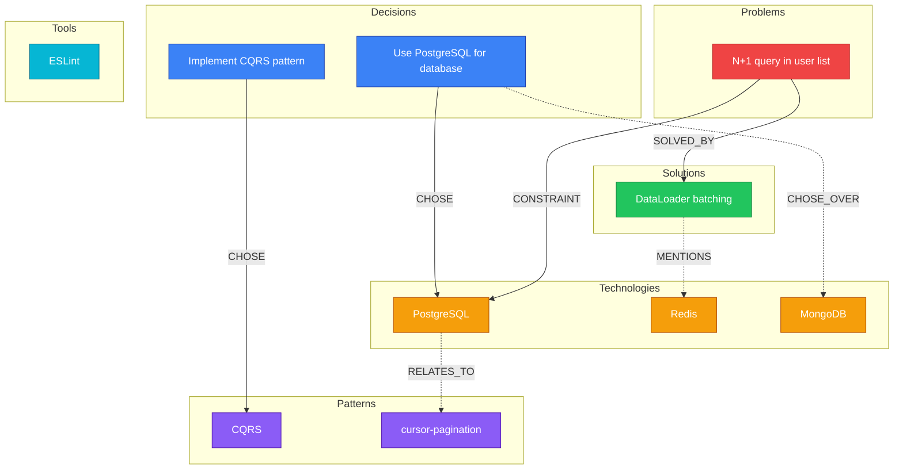
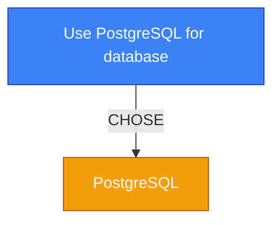
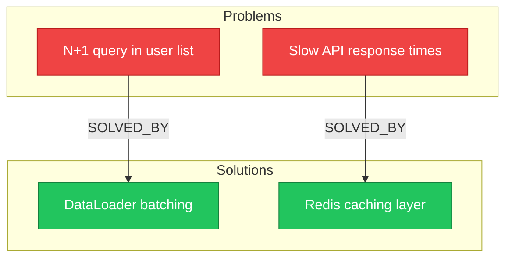

# Auto-generated from skills/graph-viz/SKILL.md
# Source: https://github.com/yonatangross/orchestkit


# Graph Visualization

Render the local knowledge graph as a Mermaid diagram from `.claude/memory/decisions.jsonl`.

Supports the full OrchestKit visualization system with **8 entity types** and **8 relation types** (GH #246).

## Usage

```bash
/ork:graph-viz                          # Full graph
/ork:graph-viz --category api           # Filter by category
/ork:graph-viz --recent 10              # Last 10 decisions
/ork:graph-viz --limit 30              # Cap at 30 entities
/ork:graph-viz --type Technology        # Show only Technology entities
/ork:graph-viz --relation CHOSE         # Show only CHOSE relations
/ork:graph-viz --layout LR              # Left-to-right layout (default: TD)
```

## Workflow

### 1. Read Decisions

Read `.claude/memory/decisions.jsonl` (one JSON object per line). Each record has:

```jsonc
{
  "type": "decision | preference | pattern | problem-solution | workflow",
  "content": {
    "what": "The decision text",
    "why": "Rationale",
    "alternatives": ["Option B", "Option C"]  // rejected alternatives
  },
  "entities": ["PostgreSQL", "cursor-pagination"],
  "metadata": {
    "category": "database",
    "timestamp": "2025-01-15T10:30:00Z",
    "confidence": 0.9,
    "source": "session-abc"
  }
}
```

### 2. Apply Filters

Parse flags from the user prompt:

| Flag | Description | Example |
|------|-------------|---------|
| `--category <cat>` | Keep records where `metadata.category` matches | `--category api` |
| `--recent <N>` | Keep only the last N records by timestamp | `--recent 10` |
| `--limit <N>` | Cap total entities shown (default: 50) | `--limit 30` |
| `--type <T>` | Show only entities of this type | `--type Technology` |
| `--relation <R>` | Show only edges of this relation type | `--relation CHOSE` |
| `--layout <dir>` | Diagram direction: `TD` (top-down) or `LR` (left-right) | `--layout LR` |

### 3. Extract Entities and Relations

From each decision record, extract the 8 entity types and 8 relation types defined in the OrchestKit visualization system.

#### 8 Entity Types

| Type | Description | Example | Color |
|------|-------------|---------|-------|
| **Decision** | An explicit choice made | "Use PostgreSQL for database" | Blue `#3B82F6` |
| **Preference** | A stated preference or default | "Prefer functional components" | Green `#10B981` |
| **Problem** | An identified issue or challenge | "N+1 query problem in user list" | Red `#EF4444` |
| **Solution** | A resolution to a problem | "Use DataLoader for batching" | Bright Green `#22C55E` |
| **Technology** | A specific tool, library, or framework | "PostgreSQL", "Redis", "FastAPI" | Orange `#F59E0B` |
| **Pattern** | An architectural or design pattern | "cursor-pagination", "CQRS" | Purple `#8B5CF6` |
| **Tool** | A development tool or utility | "ESLint", "Docker", "k6" | Cyan `#06B6D4` |
| **Workflow** | A process or sequence of steps | "PR review process", "deploy pipeline" | Pink `#EC4899` |

#### Entity Extraction Rules

1. **Decision records** (`type: "decision"`) create a Decision entity from `content.what`
2. **Preference records** (`type: "preference"`) create a Preference entity from `content.what`
3. **Problem-solution records** (`type: "problem-solution"`) create both a Problem entity (from `content.what`) and a Solution entity (from `content.resolution` or `content.why`)
4. **Pattern records** (`type: "pattern"`) create a Pattern entity from `content.what`
5. **Workflow records** (`type: "workflow"`) create a Workflow entity from `content.what`
6. **All records**: Extract Technology, Tool, and Pattern entities from the `entities` array using type inference:
   - Known frameworks/databases/languages -> Technology
   - Known dev tools (linters, Docker, CI tools) -> Tool
   - Everything else -> Pattern (default)

#### 8 Relation Types

| Relation | Description | Edge Style | Example |
|----------|-------------|------------|---------|
| **CHOSE** | Selected this option | Solid thick blue `-->` | Decision -> Technology |
| **CHOSE_OVER** | Rejected alternative | Dashed red `-..->` | Decision -> Alternative |
| **MENTIONS** | References without strong link | Dotted gray `-.->` | Any -> Any |
| **CONSTRAINT** | Limits or constrains | Solid orange `-->` | Problem -> Technology |
| **TRADEOFF** | Acknowledged tradeoff | Dashed purple `-..->` | Decision -> Pattern |
| **RELATES_TO** | General association | Dotted gray `-.->` | Entity -> Entity |
| **SOLVED_BY** | Problem resolved by solution | Solid green `-->` | Problem -> Solution |
| **PREFERS** | Preference relationship | Solid teal `-->` | Preference -> Entity |

#### Relation Inference Rules

1. **Decision -> Technology**: `CHOSE` (from the chosen entity)
2. **Decision -> Alternative**: `CHOSE_OVER` (from `content.alternatives` array)
3. **Preference -> Entity**: `PREFERS` (from preference records)
4. **Problem -> Solution**: `SOLVED_BY` (from problem-solution records)
5. **Problem -> Technology**: `CONSTRAINT` (when a problem mentions a technology)
6. **Decision -> Pattern**: `TRADEOFF` (when `content.tradeoffs` exists)
7. **Co-occurring entities in same record**: `RELATES_TO`
8. **All other references**: `MENTIONS`

### 4. Generate Mermaid Diagram

Output a `graph TD` (or `graph LR` if `--layout LR`) Mermaid diagram.

#### Class Definitions (8 entity colors)

```mermaid
graph TD
    %% === Entity Type Styles ===
    classDef decision fill:#3B82F6,stroke:#1E40AF,color:#fff
    classDef preference fill:#10B981,stroke:#047857,color:#fff
    classDef problem fill:#EF4444,stroke:#B91C1C,color:#fff
    classDef solution fill:#22C55E,stroke:#15803D,color:#fff
    classDef tech fill:#F59E0B,stroke:#B45309,color:#fff
    classDef pattern fill:#8B5CF6,stroke:#5B21B6,color:#fff
    classDef tool fill:#06B6D4,stroke:#0E7490,color:#fff
    classDef workflow fill:#EC4899,stroke:#BE185D,color:#fff
```

#### Node ID Prefixes

| Type | Prefix | Example |
|------|--------|---------|
| Decision | `d_` | `d_use_postgresql` |
| Preference | `pref_` | `pref_functional_components` |
| Problem | `prob_` | `prob_n1_query_problem` |
| Solution | `sol_` | `sol_dataloader_batching` |
| Technology | `t_` | `t_postgresql` |
| Pattern | `p_` | `p_cursor_pagination` |
| Tool | `tool_` | `tool_eslint` |
| Workflow | `w_` | `w_pr_review_process` |

#### ID Sanitization Rules

- Lowercase the entire name
- Replace spaces, hyphens, dots, and special characters with underscores
- Remove characters except `[a-z0-9_]`
- Prefix with the type abbreviation
- Use quoted labels: `id["Human Readable Label"]`

#### Subgraph Organization

Group nodes into subgraphs by entity type. Only include subgraphs that have entities:



#### Edge Styling by Relation Type

| Relation | Mermaid Syntax | Visual |
|----------|---------------|--------|
| CHOSE | `-->│CHOSE│` | Solid arrow (strong positive) |
| CHOSE_OVER | `-..->│CHOSE_OVER│` | Long dash (rejected) |
| MENTIONS | `-.->│MENTIONS│` | Dotted (weak reference) |
| CONSTRAINT | `-->│CONSTRAINT│` | Solid arrow (limiting) |
| TRADEOFF | `-..->│TRADEOFF│` | Long dash (acknowledged cost) |
| RELATES_TO | `-.->│RELATES_TO│` | Dotted (general link) |
| SOLVED_BY | `-->│SOLVED_BY│` | Solid arrow (resolution) |
| PREFERS | `-->│PREFERS│` | Solid arrow (preference) |

### 5. Output Stats Summary

After the Mermaid diagram, output a statistics table:

```
Graph Statistics:
- Decisions: 12
- Preferences: 3
- Problems: 5
- Solutions: 4
- Technologies: 8
- Patterns: 5
- Tools: 3
- Workflows: 2
- Total entities: 42
- Total relations: 67
- CHOSE: 12, CHOSE_OVER: 8, MENTIONS: 15, CONSTRAINT: 5
- TRADEOFF: 4, RELATES_TO: 12, SOLVED_BY: 4, PREFERS: 7
- Time span: 2025-01-10 to 2025-01-20
- Graph queue depth: 3 pending operations
```

Include a legend section at the bottom:

```
Legend:
  🔵 Decision  🟢 Preference  🔴 Problem  🟩 Solution
  🟠 Technology  🟣 Pattern  🔷 Tool  🩷 Workflow

  ─── Strong link (CHOSE, SOLVED_BY, PREFERS, CONSTRAINT)
  - - Rejected/tradeoff (CHOSE_OVER, TRADEOFF)
  ··· Weak reference (MENTIONS, RELATES_TO)
```

### 6. Large Graph Handling

For graphs with **more than 50 entities**:

1. Count connections per entity
2. Keep the top N entities by connection count (N = `--limit` or 50)
3. Switch to `graph LR` for better readability
4. Add note: *"Showing 50 of 120 entities (most connected). Use `--limit` to adjust."*

For graphs with **more than 100 relations**:

1. Only show CHOSE, SOLVED_BY, PREFERS, CONSTRAINT (strong relations)
2. Collapse MENTIONS and RELATES_TO into a count note
3. Add note: *"Hiding 45 weak relations (MENTIONS, RELATES_TO). Use `--relation all` to show."*

## Error Handling

| Condition | Output |
|-----------|--------|
| `decisions.jsonl` missing or empty | "No memories stored yet. Use `/ork:remember` to start building your knowledge graph." |
| All records filtered out by `--category` | "No decisions found for category '\<cat\>'. Available categories: database, api, ..." |
| All records filtered out by `--type` | "No entities of type '\<type\>' found. Available types: Decision, Technology, ..." |
| JSONL has corrupt lines | Skip them and note: "Skipped N corrupt records" |
| Single entity, no relations | Show the entity with a note: "Only 1 entity found. Store more decisions to see relationships." |

## Examples

### Minimal Graph (1-3 decisions)

```
/ork:graph-viz
```

Output:
````


Graph Statistics:
- Decisions: 1, Technologies: 1
- Total: 2 entities, 1 relation
- Time span: 2025-01-15
````

### Problem-Solution Graph

```
/ork:graph-viz --type Problem --type Solution
```

Output:
````

````

### Full Production Graph

```
/ork:graph-viz --recent 20
```

Produces a comprehensive diagram with all 8 entity types, subgraphs, color coding, and relation styling as described above.

## Related Skills

- [Mermaid Patterns](references/mermaid-patterns.md) - Full color scheme, edge styles, and diagram patterns
- `remember` - Store decisions to graph
- `recall` - Search the graph
- `decision-history` - Timeline view of decisions
- `memory-fabric` - Cross-tier memory orchestration
